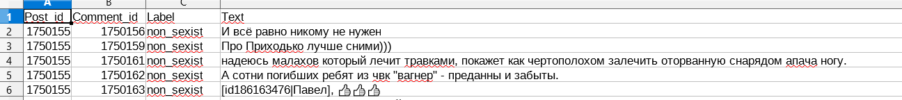

#### 1.2. The process of collecting corpora.

##### 1.2.1 Media sources

The first source was the Russian social network Vkontakte (avaliable at https://vk.com/ ). It is perfectly equipped for the needs of developers, right inside it is provided with an API with detailed documentation.

We chose three different popular groups in vk, representing three different Russian media. They all have more than 500,000 subscribers, and ideologically they represent different directions.
The media we have chosen are: 

**"Lentach"** (https://vk.com/oldlentach) is a highly oppositional media in the past, now with a slightly less obvious focus, especially interesting because of the huge number of subscribers (over 2 million). Comments are cleaned by the bot: comments shorter than five words are prohibited, which members of the community are fighting with the help of padding - for example, writing five words comments like: "bot blow [me] three four five". Also in the comments obscene words are prohibited, but but not too ingenious, which gives rise to a lot of obscene vocabulary, where words are spelled in the opposite direction or letters are omitted. The rest of the restrictions seem insignificant to us.

**"Medusa"** (https://vk.com/meduzaproject) is a liberal, oppositional media (more than 500,000 subscribers); the only media that promotes feminist views (at least on words). However, there may also be very long sexist debates in the comments. (Comments are open to all)

**"RT News in Russian"** (https://vk.com/rt_russian) - part of Russia Today, basically just automatically post articles published on the portal. Despite the impressive list of rules for commentators, comments are not particularly moderated. Since there are so many posts, the comments are not so numerous, despite the large number of subscribers (over a million).

We approached all these media in the same way, trying to find the comments we are interested in. This function was responsible for collecting the corpus (it can be found [in this file](https://github.com/clips/gsoc2019_crosslang/blob/master/sexism_detector/collect_corpus.py)):
```python
def make_corpus(name,community, query_list, service_token,vk_api_vers):
```
We used it to find posts with any of the words in the query list because we assumed that it was the news related to these topics that would cause the most discussion. Here we also give the translation of the query sheet: 
```python
query_list= {'sexism', 'meToo', 'sexual harassment', 'decriminalization of domestic violence', 'rape', 'feminism', 'Shurygina', 'harassment' }
```
For each post we took only the first hundred comments: quite often news posts were compilative (included several different news), and then the whole dialogue could be devoted to something else. Often, this also turned out to be a type of hate speech, for example, our corpus contains a rather long racist dialogue related to Yakutia.
In the resulting corpus we wrote the post id, comment id, label (by default, it just had "sexist" as label, and then I manually checked the text of the comment). 

When I checked each comment, I marked the label as one of three possible ones: "sexist", "not sexist" and "sexist in context". The latter category was used for messages that were not sexist in isolation from the context, but worked in this way in conjunction with the post. I did not include them in my train/test datasets, but they also present an interesting potential for analysis. (Read more about this in the last part of our report).

##### 1.2.2. Forum sources.

The main source of sexist comments was the Antibab website (avaliable at https://antiwomen.ru/index.php), the name of which can be literally translated as "Anti-Women". There, a group of users (presumably mostly male) discusses women and their ultra-patriarchal views of life. 

A lot of material was collected, more than 10,000 posts, but I decided to reduce the sample of messages that were taken from this forum: people there have very specific vocabulary, slang and manner of speech (+ the forum is mostly for people after thirty), so there has always been a danger that instead of detecting sexism, model will simply detect the users of this forum. To balance this, I found there a couple of topics with mostly non-sexist comments. I used them to get enough non-sexist material with a similar manner of speech.
Data collection was the responsibility of the method: 

```python
def make_corpus_ant_forum(name,link_to_topic):
```
written by me, using Beautiful Soup. The method needs the name of the new file, where the corpus gonna be saved, and a link to the topic to scrape. 

The main source of non-sexist speech was the Holywar forum (avaliable at https://holywarsoo.net/index.php), where I extracted a large topic devoted to family relations (problems with parents, close relatives, etc.). This was once again done in the hope that even at the level of the data it will be possible to balance the sexist and non-sexist. It would not be desirable for the model to consider the mentioning of women as sexist, for example. 
The method to extract this data worked similarly to the previous one.

##### 1.2.3. The description of resulted corpora.

All of them can be found in the folder [gsoc2019_crosslang/russian sexist corpora/annotated/](https://github.com/clips/gsoc2019_crosslang/tree/master/russian%20sexist%20corpora/annotated)

Name of the corpora | Description
------------ | -------------
ant_1.csv | Non-sexist comments (with some exception) of the antibab-forum
ant_2.csv | Sexist comments (with some exception) of the antibab-forum
media_1.csv | Non-sexist and sexist comments from Lentach
media_2.csv | Non-sexist and sexist comments from Medusa
media_3.csv | Non-sexist and sexist comments from Russia Today
ns_1.csv | Very big, purely non-sexist corpus from Holywar forum

In the end we have 2577 annotated sexist comments and 21526 non sexist comments, which makes our corpus unabalanced, to some extent. 
